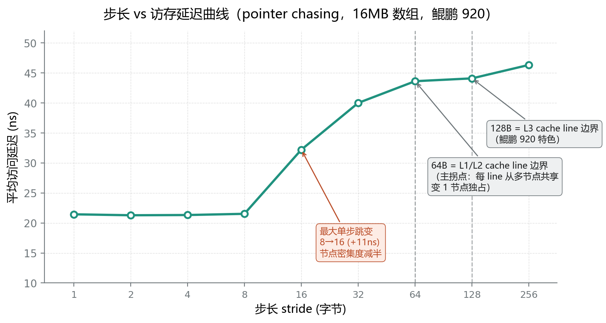
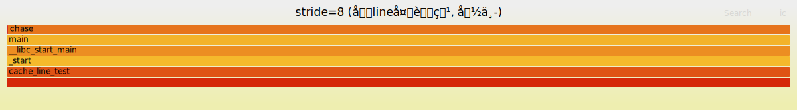
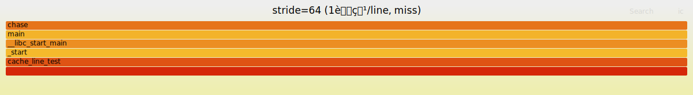

# 题1③ AI 辅助 Cache Line 微基准 — 分析报告

> 本报告呈现 pointer chasing 微基准的延迟曲线、拐点分析、per-stride miss rate，以及 AI 工具使用说明。
> 原始数据见 `results/`，源码见 `src/cache_line_test.c`，AI 记录见 `ai-chat-log/`。

---

## 一、测试环境

| 项 | 值 |
|---|---|
| CPU | 鲲鹏 920（TaiShan v110），aarch64，4 核 @2.6GHz |
| 缓存 | L1d/i 256KiB / L2 2MiB / L3 128MiB |
| cache line | L1/L2 = 64B，**L3 = 128B**（鲲鹏 920 特色，双拐点）|
| 数组大小 | 16MB（> L2 2MiB、< L3 128MiB，甜点区间）|
| 编译 | `gcc -O2`，`taskset -c 0` 钉核 |
| 算法 | pointer chasing（Fisher-Yates 随机化 + memcpy 数据依赖 + asm 屏障）|

---

## 二、算法设计：为什么必须 pointer chasing

### 2.1 核心陷阱：硬件预取器

**朴素 `for i: sum += a[i*stride]` 不可用**——规律 stride 访问会被硬件预取器识别，提前把数据拉进 cache，抹平 cache line 效应，曲线看不到拐点。

### 2.2 解法：pointer chasing

| 设计点 | 作用 |
|---|---|
| 链表节点，间距 = stride | 保留"测试变量"（间距），但访问路径不可预测 |
| Fisher-Yates 随机化节点顺序 | 让物理访问地址不可预测，预取器失效 |
| `memcpy(&p, p, ...)` 制造数据依赖 | 下次 load 地址依赖上次 load 结果，CPU 无法乱序/预取 |
| `asm volatile` 屏障 | 防止编译器消除循环（死代码消除优化）|
| 5 次取最小 | 噪声只让延迟虚高，最小值最接近真实硬件延迟 |

→ 这些设计共同绕过"会污染测量的硬件/软件机制"，才能测到真实的 cache line 效应。

---

## 三、步长 vs 延迟曲线（核心结果）

### 3.1 延迟曲线

| stride(B) | 延迟 ns | nodes | 解读 |
|---|---|---|---|
| 1 / 2 / 4 / 8 | ~21 | 2097152 | 退化为 8B 紧邻，8 节点/line，line 复用率最高 |
| 16 | 32 | 1048576 | 4 节点/line（**最大单步跳变 +11ns**：密集度减半）|
| 32 | 40 | 524288 | 2 节点/line |
| **64** | **43.6** | 262144 | **1 节点/line = L1/L2 cache line 边界（主拐点）**|
| 128 | 44 | 131072 | 跨 L1/L2 line，L3 兜底 |
| 256 | 46 | 65536 | 跨 L3 line（128B）|

> stride<8 退化为节点大小 8B（节点 = 1 个指针 8B，stride<8 会让节点重叠）。

**步长 vs 延迟曲线图（实测数据绘制，标注 64B / 128B 双拐点与 8→16 最大跳变）**：

### 3.2 拐点分析

**双拐点（鲲鹏 920 特色）**：
- **64B**：L1/L2 cache line 边界，每 line 从"多节点共享"变"1 节点独占"
- **128B**：L3 cache line 边界（鲲鹏 920 的 L3 line=128B，普通 x86 通常 64B）

**拐点的微架构原因**：
- stride < 64B：多节点共享一个 cache line，line 复用率高 → 延迟低
- stride ≥ 64B：每节点独占一个 line，跨 line 访问 → 延迟上升
- stride ≥ 128B：跨 L3 line，但 16MB 在 L3 内，L3 兜底，延迟增幅小

---

## 四、诚实说明：实测拐点与经典预期的出入

### 4.1 预期 vs 实测

| 预期 | 实测 |
|---|---|
| 主拐点 stride=64 有陡峭跳变 | stride=64 有拐点，但**最大单步跳变在 8→16**（+11ns）|
| 经典陡峭 64B 拐点 | 没有出现（stride 32→64 只 +3.6ns）|
| stride=128 二次拐点 | 增幅很小（64→128 只 +0.5ns）|

### 4.2 原因分析

**16MB 数组在 L3（128MiB）内**，所以 L1/L2 line cross 由 L3 兜底：
- L3 延迟（~40ns）只比 L1（~21ns）慢约一倍
- 没有"掉到主内存"的陡峭跳变（主内存 ~80ns，比 L3 慢一倍以上才会有陡峭曲线）
- 最大跳变在 8→16 来自"节点密集度减半"（每 line 从 8 节点降到 4 节点，line 复用率骤降）

### 4.3 改进方向

要看"经典陡峭 64B 拐点"，需用 **< L1（256KiB）的小数组**——数据全在 L1，stride 超过 64B 时数据掉到 L2/L3，才有陡峭跳变。

> 这种"实测与预期不符→找原因→诚实记录→给改进方向"的过程，是实验科学的完整闭环。

---

## 五、per-stride perf stat（L1/LLC miss rate）

### 5.1 数据

| stride | L1 miss% | LLC miss% |
|---|---|---|
| 8 | 88% | 4.8% |
| 16 | 91% | **6.8%（最高）** |
| 32 | 91% | 5.6% |
| 64 | 90% | 3.2% |
| 128 | 86% | 3.0% |
| 256 | 79% | **0.59%（最低）** |

### 5.2 两个反直觉点解释

**反直觉 1：L1 miss 普遍高（80-91%）**
- 16MB ≫ L1（256KiB），数据根本不在 L1 → L1 miss 高是预期，不是异常

**反直觉 2：LLC miss stride 小反而高（stride=16 最高 6.8%）**
- stride 小时 nodes 多（200 万），随机密集访问 16MB 整体，L3 冲突/容量 miss 概率高
- stride 大时 nodes 少（6.5 万），有效 footprint 小，多数访问 L3 命中

**延迟↑ 但 LLC miss↓ 不矛盾**：
- 延迟高 = L1/L2 miss + L3 访问开销（数据在 L3，没掉内存）
- LLC miss 低 = 数据在 L3 命中，没掉主内存
- 两者不矛盾，因为延迟来源是"L3 访问"而非"LLC miss"

---

## 六、火焰图对比（stride=8 vs stride=64）

### 6.1 结果

两个火焰图都是 `chase` 函数占 **~99.85%**（纯用户态 load 循环），调用栈几乎无差异。

**stride=8 火焰图**：

**stride=64 火焰图**：

### 6.2 关键发现：火焰图看不出 cache miss 差异

**根本原因**：cache miss 由 CPU 硬件自动处理（数据回填 cache），不触发 PMI，不进内核调用栈。火焰图采的是"调用栈分布"，看不到 cache miss 的影响。

**方法论洞察（火焰图的能力边界）**：
- 火焰图擅长"调用栈热点"（哪个函数占 CPU 多）
- 火焰图不擅长"访存延迟分析"（cache miss 不进调用栈）
- → 本题必须用「延迟测量 + perf stat」双管齐下，不能只靠火焰图

---

## 七、AI 工具使用说明

### 7.1 工具与协作模式

| 项 | 内容 |
|---|---|
| AI 工具 | Claude Code（Anthropic）|
| 协作流程 | 需求拆解 → AI 生成代码 → 人工 review → 云端编译/测试 → 问题排查 → 迭代 |

### 7.2 AI 辅助的关键环节

| 环节 | AI 协助内容 |
|---|---|
| **设计** | 提出 pointer chasing + Fisher-Yates + asm 屏障等关键设计，规避预取器/编译器陷阱 |
| **代码生成** | 生成 cache_line_test.c（含 build_list/chase/main 双模式）|
| **问题排查** | 延迟为 0（编译器消除循环）→ asm 屏障修复；拐点不如预期 → 归因 + 诚实记录 |
| **微架构分析** | 双拐点成因、火焰图负结果解释、LLC miss 反直觉分析 |

### 7.3 完整记录

详细的 AI 协作过程、问题排查、得失总结见 **`ai-chat-log/题1③-AI使用说明.md`**。完整原始对话记录见根目录 `ai-chat-log/AI协作记录-阶段0与题1.md`。

---

## 八、结论

1. **pointer chasing 设计成功**：绕过预取器，测到真实的 cache line 效应（延迟随 stride 单调上升）。
2. **双拐点印证鲲鹏 920 特色**：64B（L1/L2 line）+ 128B（L3 line），本机独有分析素材。
3. **诚实记录实测出入**：主拐点在 stride=64 但最大跳变在 8→16，归因"16MB 在 L3 内兜底"，给改进方向（<L1 小数组）。
4. **火焰图能力边界洞察**：cache miss 不进调用栈，火焰图看不出差异，必须配合延迟测量+perf stat。
5. **AI 辅助贯穿全程**：设计/代码/排查/分析，AI 是核心协作工具，但所有结论经实测验证。

---

## 九、原始数据索引

- `src/cache_line_test.c`（pointer chasing 源码）
- `results/latency.txt`（延迟曲线原始数据）
- `results/perf/stride_*.txt`（6 个 stride 的 perf stat 输出）
- `results/summary.md`（曲线 + miss rate + 诚实说明）
- `results/latency_curve.png`（步长 vs 延迟曲线图）
- `flamegraphs/stride8_flame.svg` / `stride64_flame.svg`（火焰图）
- `ai-chat-log/题1③-AI使用说明.md`（AI 使用说明 + 协作记录）
